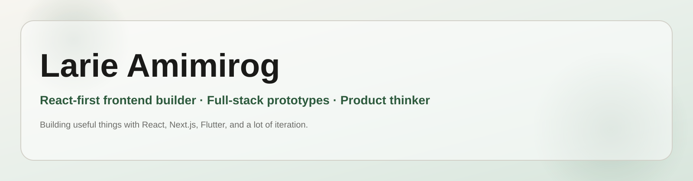

	

<h1 align="center">Hi, I'm Larie Amimirog</h1>

	React-first frontend builder, full-stack prototype maker, and product thinker.

	<a href="https://melee45.github.io/larie-portfolio/">Portfolio</a> ·
	<a href="mailto:amimirog@gmail.com">Email</a> ·
	<a href="https://github.com/melee45">GitHub</a>

	<table>
		<tr>
			<td align="center" width="33%"><strong>React-first</strong> Frontend systems and polished UI</td>
			<td align="center" width="33%"><strong>Full-stack</strong> Next.js, Firebase, Supabase, PostgreSQL</td>
			<td align="center" width="33%"><strong>Product-minded</strong> Prototypes, experiments, and shipped work</td>
		</tr>
	</table>

## Featured Projects

<table>
	<tr>
		<td width="50%">
			<strong>TechFocus PH</strong> 
			Transportation tech platform in progress. 
			<a href="https://techfocus-ph.vercel.app/">Live preview</a>
		</td>
		<td width="50%">
			<strong>AI Career Hub</strong> 
			AI-assisted career tools and content workflows. 
			<a href="https://ai-companion-hub-self.vercel.app/">Live demo</a>
		</td>
	</tr>
	<tr>
		<td width="50%">
			<strong>Barangay Profiling System</strong> 
			Deployed community profiling app built with Flutter and Firebase. 
			<a href="https://barangay-profiling-system.web.app/">Live app</a>
		</td>
		<td width="50%">
			<strong>Kwaygo</strong> 
			Flutter startup app and competition winner. 
			<a href="https://kwaygo.com/">Visit site</a>
		</td>
	</tr>
</table>

## Stack

React, Next.js, TypeScript, Tailwind CSS, Flutter, Firebase, Supabase, PostgreSQL, Python, GitHub Actions

## Contact

- Email: amimirog@gmail.com
- GitHub: [@melee45](https://github.com/melee45)
